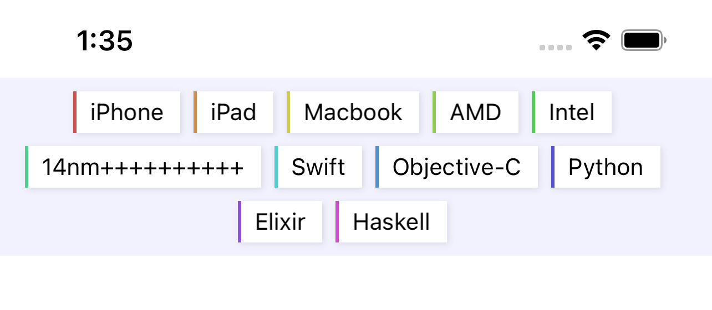

# FlexibleView




## Usage

```swift
let flexView = FlexibleView()
flexView.horizentalAlignment = .center
flexView.horizontalSpacing = .fixed(8)
flexView.verticalSpacing = .fixed(8)
flexView.contentInsets = .init(top: 8, left: 8, bottom: 8, right: 8)
tags.forEach {
	flexView.addFlexibleItem(TagLabel(tagName: $0))
}
```

## Installation

### Swift Package Manager
* File > Swift Packages > Add Package Dependency
* Add https://github.com/octree/FlexibleView.git
* Select "Up to Next Major" with "1.0.0"

### CocoaPods

```ruby
pod 'FlexibleView'
```


## License

Pretty is released under the MIT license. See LICENSE for details.